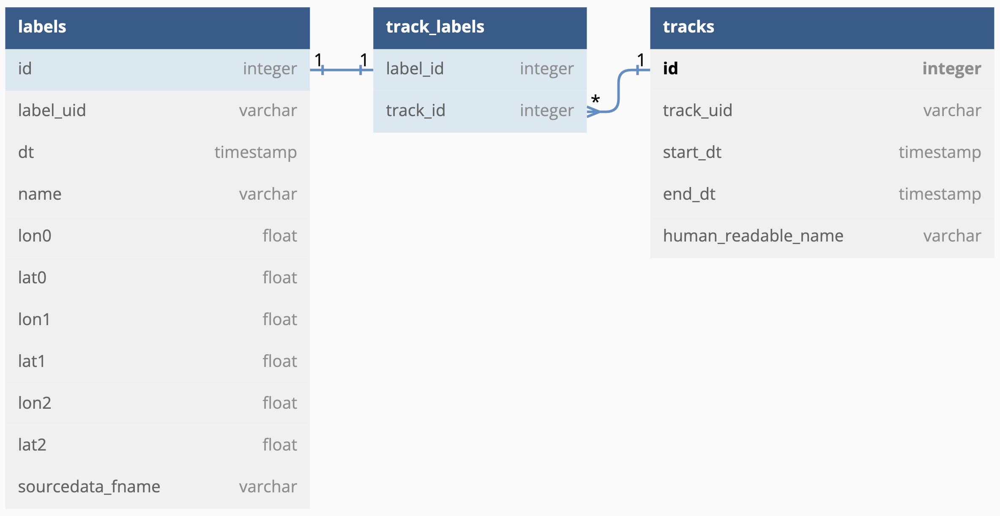

# DaMesCoS
Dataset of Mesoscale Convective Systems

The database is available in the form of SQLite `*.db` file (we name it `DaMesCoS-ETR.db`) via the [link](https://ml4es.ru/links/damescos-etr)

Here we present the schema of the database:

